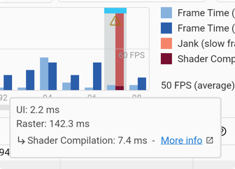
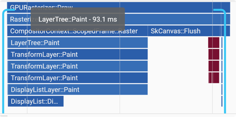

# 异步文本布局

## 调研

官方对异步布局也有讨论：2-step text layout，但是讨论却往奇怪的方向发展了，简单来说就是将 text layout 放在异步线程，然后在 UI 线程等待 layout 完成，最后的结论就是不做：

> The more I think about this, the more I think that two step layout won't really work.
> The two biggest problems are:
> - There isn't enough time between build and layout to get enough work done
> - There's serious risk of getting wedged if synchronous work on the UI thread has to wait on thread scheduling concerns on some thread or threads for text layout.

然后提出[建议](https://github.com/flutter/flutter/issues/96617)：

> I'm partial to the idea of opening up an API like drawGlyphs, since there would be plenty of FFI based opportunities to shape and layout text appropriately, and would allow for use cases that want to do shaping off-device (i.e. for a font you know is shipped with your app).

我在 Engine 中实现了这个接口，参考：[Draw glyph run](https://github.com/NanoMichael/engine/pull/1/files)。

Android 也有类似接口：PrecomputedText，一个简单例子：

```kotlin
private suspend fun asyncText() {
  val view = binding.textviewSecond
  val longText = getString(R.string.lorem_ipsum)
  val params = PrecomputedTextCompat.Params(view.textMetricsParams)
  val precomputedText = withContext(Dispatchers.Default) {
    PrecomputedTextCompat.create(longText, params)
  }
  view.text = precomputedText
}
```

主要有一个问题：这里异步布局需要依赖 Text 或 RichText widget，也就是说异步发生在 Text 或 RichText layout 时，这样会造成屏幕闪动或白屏（因为在还未布局完成之前其 layout 占据的空间可能为 0，完成布局之后需要刷新整个页面树）。

和 Android 思路类似，要解决这个问题需要将 layout 再提前到 build 之前。

## 整体思路

将异步布局在 Engine 层实现。Paragraph 增加 layoutAsync 接口，在 Engine 层实现在子线程中布局，完成后在 UI 线程回调 Dart callback。

- 不依赖 Text 和 RichText widget
- 跟 Android 类似，将 TextPainter 作为 PrecomputedText，需要修改 Flutter framework

在 TextPainter 以及 Paragraph 中增加 layoutAsync 接口：

```dart
// file: flutter/packages/flutter/lib/src/painting/text_painter.dart
//
Future<void> layoutAsync({ double minWidth = 0.0, double maxWidth = double.infinity }) {
  ...
}
// file: engine/src/out/host_debug_unopt/gen/dart-pkg/sky_engine/lib/ui/text.dart
//
Future<void> layoutAsync(ParagraphConstraints constraints) {
  final completer = Completer();
  _layoutAsync(constraints.width, () {
    print('layout complete');
    _needsLayout = false;
    completer.complete();
  });
  return completer.future;
}
@FfiNative<Void Function(Pointer<Void>, Double, Handle)>('Paragraph::layoutAsync')
external void _layoutAsync(double width, void Function() callback);
```

Engine C++ 层实现 layoutAsync 接口，在 IO runner 中进行布局，关键代码：

```C++
void Paragraph::layoutAsync(double width, Dart_Handle callback_handle) {
  auto callback =
      new tonic::DartPersistentValue(UIDartState::Current(), callback_handle);
  const auto& runners = UIDartState::Current()->GetTaskRunners();
  const auto run = [paragraph = std::weak_ptr(m_paragraph),
                    ui_runner = runners.GetUITaskRunner(), width,
                    dart_callback = callback]() {
    if (auto p = paragraph.lock()) {
      FML_DLOG(ERROR) << "layout start...";
      p->Layout(width);
      FML_DLOG(ERROR) << "layout end...";
      // TODO: adjust width
      fml::TaskRunner::RunNowOrPostTask(ui_runner, [dart_callback] {
        if (dart_callback->is_empty()) {
          FML_DLOG(ERROR) << "callback is empty...";
          return;
        }
        const auto dart_state = dart_callback->dart_state().lock();
        if (!dart_state) {
          FML_DLOG(ERROR) << "dart state no longer exists...";
          return;
        }
        tonic::DartState::Scope scope(dart_state);
        FML_DLOG(ERROR) << "invoke dart callback...";
        tonic::DartInvoke(dart_callback->Release(), {});
        delete dart_callback;
      });
    }
  };
  runners.GetIOTaskRunner()->PostTask(run);
}
```

直接使用已经 layout 好的 TextPainter：

```dart
class PrecomputedText extends LeafRenderObjectWidget {
  final TextPainter _textPainter;

  const PrecomputedText(this._textPainter, {super.key});

  @override
  RenderObject createRenderObject(BuildContext context) {
    return RenderPrecomputedText(_textPainter);
  }
}

class RenderPrecomputedText extends RenderBox {
  final TextPainter textPainter;

  RenderPrecomputedText(this.textPainter);

  @override
  void performLayout() {
    size = Size(constraints.maxWidth, constraints.maxHeight);
  }

  @override
  void paint(PaintingContext context, Offset offset) {
    textPainter.paint(context.canvas, offset);
  }
}
```

测试使用：

```dart
Widget _buildAsyncText() {
  return LayoutBuilder(builder: (context, constraints) {
    return FutureBuilder(
      builder: (context, AsyncSnapshot<TextPainter> snapshot) {
        if (snapshot.hasData) {
          return PrecomputedText(snapshot.data!);
        }
        return CircularProgressIndicator();
      },
      future: _loadLongText().then((value) async {
        final p = TextPainter(
          textDirection: TextDirection.ltr,
          text: TextSpan(text: value),
        );
        await p.layoutAsync(maxWidth: constraints.maxWidth);
        return p;
      }),
    );
  });
}
```

_loadLongText 方法加载了一个比较长的文本（共 25220 个字符），效果：

<video width="480" height="640" controls>
  <source src="imgs/async-text.mp4" type="video/mp4">
</video>




可见即使异步布局，在 post 回 UI 线程后，在 raster 线程上的耗时依然不少。主要原因是字形太多，一次性绘制完成耗时依然严重。

一个思考：想起来 Qt 的布局 API，允许用户以行级别进行布局，如果能实现按需 layout，按需 paint，性能表现应该会不错。

这个 Demo 仅仅探索了 async layout 的可行性，并仅使用已经布局好的 TextPainter，如需像 Text 和 RichText widget 那样使用还需要对 infra 的引擎进一步改造（我在自己本机上使用的是 flutter 3.0，代码结构和 infra 的有很大不同，目前 infra 的版本是 2.10）。

完整代码可参考：[Add async text layout support](https://github.com/NanoMichael/engine/pull/2/files)

## 其他尝试

在其他 isolate 中布局：

```dart
final painter = compute((message) {
  final p = TextPainter(
    text: const TextSpan(text: "hello world!"),
    textDirection: TextDirection.ltr,
  );
  p.layout(maxWidth: 800);
}, 0);
```

会报如下错误，原因是 Flutter 不允许在 root isolate 之外进行 ui 操作。

```
E/flutter (27640): [ERROR:flutter/runtime/dart_vm_initializer.cc(41)] Unhandled Exception: UI actions are only available on root isolate.
E/flutter (27640): #0      ParagraphBuilder._constructor (dart:ui/text.dart:2904:42)
E/flutter (27640): #1      new ParagraphBuilder (dart:ui/text.dart:2883:7)
E/flutter (27640): #2      TextPainter._createParagraph (package:flutter/src/painting/text_painter.dart:600:44)
E/flutter (27640): #3      TextPainter.layout (package:flutter/src/painting/text_painter.dart:648:7)
E/flutter (27640): #4      _MyHomePageState._incrementCounter.<anonymous closure>.<anonymous closure> (package:test_isolate/main.dart:43:11)
E/flutter (27640): #5      _IsolateConfiguration.applyAndTime.<anonymous closure> (package:flutter/src/foundation/_isolates_io.dart:107:21)
E/flutter (27640): #6      Timeline.timeSync (dart:developer/timeline.dart:160:22)
E/flutter (27640): #7      _IsolateConfiguration.applyAndTime (package:flutter/src/foundation/_isolates_io.dart:105:21)
E/flutter (27640): #8      _spawn (package:flutter/src/foundation/_isolates_io.dart:126:67)
E/flutter (27640): #9      _delayEntrypointInvocation.<anonymous closure> (dart:isolate-patch/isolate_patch.dart:300:17)
E/flutter (27640): #10     _RawReceivePortImpl._handleMessage (dart:isolate-patch/isolate_patch.dart:192:12)
```

准确来说，是 Flutter 未在其他 isolate 绑定 Dart 到 C++ 的 ffi call：

```c++
// file: engine/src/flutter/lib/ui/dart_ui.cc
//
namespace {

std::once_flag g_dispatchers_init_flag;
std::unordered_map<std::string_view, void*> g_function_dispatchers;

void* ResolveFfiNativeFunction(const char* name, uintptr_t args) {
  auto it = g_function_dispatchers.find(name);
  return (it != g_function_dispatchers.end()) ? it->second : nullptr;
}

void InitDispatcherMap() {
  FFI_FUNCTION_LIST(FFI_FUNCTION_INSERT)
  FFI_METHOD_LIST(FFI_METHOD_INSERT)
}

}  // anonymous namespace

void DartUI::InitForIsolate(const Settings& settings) {
  std::call_once(g_dispatchers_init_flag, InitDispatcherMap);

  auto dart_ui = Dart_LookupLibrary(ToDart("dart:ui"));
  if (Dart_IsError(dart_ui)) {
    Dart_PropagateError(dart_ui);
  }

  // Set up FFI Native resolver for dart:ui.
  Dart_Handle result =
      Dart_SetFfiNativeResolver(dart_ui, ResolveFfiNativeFunction);
  if (Dart_IsError(result)) {
    Dart_PropagateError(result);
  }

  if (settings.enable_impeller) {
    result = Dart_SetField(dart_ui, ToDart("_impellerEnabled"), Dart_True());
    if (Dart_IsError(result)) {
      Dart_PropagateError(result);
    }
  }
}
```

C++ 处理 Dart Callback：

```c++
// file: engine/src/flutter/lib/ui/window/platform_message_response_dart.cc
//
template <typename Callback, typename TaskRunner, typename Result>
void PostCompletion(Callback&& callback,
                    const TaskRunner& ui_task_runner,
                    bool* is_complete,
                    const std::string& channel,
                    Result&& result) {
  if (callback.is_empty()) {
    return;
  }
  FML_DCHECK(!*is_complete);
  *is_complete = true;
  uint64_t platform_message_id = platform_message_counter.fetch_add(1);
  TRACE_EVENT_ASYNC_BEGIN1("flutter", "PlatformChannel ScheduleResult",
                           platform_message_id, "channel", channel.c_str());
  ui_task_runner->PostTask(fml::MakeCopyable(
      [callback = std::move(callback), platform_message_id,
       result = std::move(result), channel = channel]() mutable {
        TRACE_EVENT_ASYNC_END0("flutter", "PlatformChannel ScheduleResult",
                               platform_message_id);
        std::shared_ptr<tonic::DartState> dart_state =
            callback.dart_state().lock();
        if (!dart_state) {
          return;
        }
        tonic::DartState::Scope scope(dart_state);
        tonic::DartInvoke(callback.Release(), {result()});
      }));
}
```