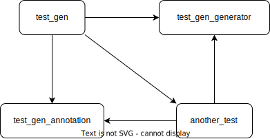
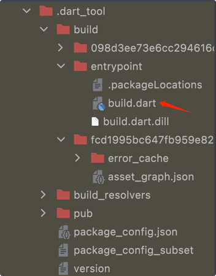

# Dart 代码生成

## 背景

有一个想法，就是通过注解生成 flutter 路由，将所有页面路由收集起来（包括子库的页面），这样实现了依赖倒置，从之前手动编写路由然后在一个文件中引入这个页面放到一个容器中的方式，变成了页面仅依赖注解，由 codegen 自动生成路由（隐含的容器依赖具体页面实现变成由 codegen 来管理，所以依赖还是存在的，但是不需要手动管理了）。

基于以上想法，调研了 Dart 代码生成的流程，最后由于 Dart codegen 不支持收集子库代码（参考 [issue](https://github.com/dart-lang/build/issues/3339)）并没有实现这个想法，还是记录以下调研的过程，以后再深入 Dart build 的时候再研究。

## 使用 source_gen

`source_gen` 是一个 Dart 库，用于生成 Dart 代码。它封装了 `dart build` 和 `dart analyzer` 等 low-level 的 API，对开发者更加友好。你不一定非得使用 source_gen 来生成代码，`dart build` 提供了更底层、更丰富的 API，可以完成更奇怪的需求。参考 [source_gen](https://pub.dev/packages/source_gen)。

### 一个例子

创建一个 Flutter 工程（当然不必是 Flutter 工程，纯 dart 工程也 OK），我给起名为 test_gen，在这个工程中创建子模块 test_gen_annotations 和 test_gen_generator，分别存放 annotation 和 generator 的代码，以及子模块 another_test，用来测试子模块的代码生成。其结构为：

```
test_gen
├── another_test
├── lib
├── pubspec.yaml
├── test_gen_annotations
├── test_gen_generator
└── ...
```

test_gen 通过 path 依赖 test_gen_annotations 和 test_gen_generator，以及 another_test。

在 test_gen_generator 中引入 `source_gen`，在 `pubspec.yaml` 中添加：

```yaml
dependencies:
  source_gen: '^1.2.2' 
```

如果 generator 不需要跟随 package 发布，可以使用 `dev_dependency`:

```yaml
dev_dependencies:
  source_gen: '^1.2.2'
```

在 test_gen_annotations 中添加类 `DummyAnnotation`，这个类没有任何意义，仅仅用来测试而已。注意：**Annotation 类构造器必须为 const (why?)**。

```dart
class DummyAnnotation {
  final String comment;
  final int id;

  const DummyAnnotation({required this.comment, required this.id});
}
```

然后在 test_gen 的 lib 文件夹中添加文件 `a_dummy.dart`，添加类 `ADummyClass`：

```dart
@DummyAnnotation(
  comment: 'This is a dummy annotation',
  id: 1,
)
class ADummyClass {}
```

为了测试子文件夹的生成，我们在 `lib` 中添加文件 `sub_dir/sub_dummy.dart`，增加类：

```dart
@DummyAnnotation(
  comment: 'This is a dummy annotation in sub folder',
  id: 2,
)
class SubDummy {}
```

文件结构如下：

```
lib
├── a_dummy.dart
├── main.dart
└── sub_dir
    └── sub_dummy.dart
```

特别的，为了测试子模块的代码生成，在 `another_test/lib` 中添加文件 `another_dummy.dart`，增加类：

```dart
import 'package:test_gen_annotations/test_gen_annotations.dart';

@DummyAnnotation(
  comment: 'Another dummmy class in another_test package',
  id: 4,
)
class AnotherDummyClass {}
```

我们的目标是根据 annotation `DummyAnnotation` 生成如下代码：

```dart
// desc: $comment
// with a dummy id: $id
const DUMMY_COMMENT_${className}_${suffix} = "$suffix: $comment";
```

在 `test_gen_generator` 子工程中中添加文件 `test_gen_generator`，编写代码（这自然也没意义，仅仅用来测试而已）：

```dart
class DummyGenerator extends GeneratorForAnnotation<DummyAnnotation> {
  final String nameSuffix;

  DummyGenerator(this.nameSuffix);

  @override
  generateForAnnotatedElement(Element element, ConstantReader annotation, BuildStep buildStep) {
    final id = annotation.peek('id')?.intValue;              // 1
    final comment = annotation.peek('comment')?.stringValue; // 2
    return '''
    // desc: $comment
    // with a dummy id: $id
    const DUMMY_COMMENT_${element.name}_$nameSuffix = "$nameSuffix: $comment";
    '''; // 3
  }
}
```

代码解释：

1. 取出 annotation 中的 id 属性的值
2. 取出 comment 属性的值
3. 根据 id 和 comment 生成需要的代码

- `element`：被修饰的类/方法等元素的详细信息，以下是常见方法/属性：
  ```dart
  element.name        // 元素的名称
  element.displayName // 元素的显示名称
  element.kind        // 类/属性/方法等
  ```
- `annotation`：被修饰的元素的注解信息，最常用的几个方法：
  - `read`：读取指定的属性的值，如果属性不存在，抛出 `FormatException` 异常 
  - `peek`：取出注解中的某个属性的值，如果属性不存在，返回 `null`。`read` 和 `peek` 获取到的结果是 `ConstantReader` 类型，可以通过 `ConstantReader.xxxValue` 等方法获取值。我们可以通过 `isXXX` 来判断值的类型，比如：`annotation.peek('comment')?.isString // true`

Annotation 为修饰的类提供了参数性描述（或配置），我们根据这些描述来生成代码。

以上工作都完成后，我们来配置依赖：

1. test_gen（root package）需要依赖 test_gen_annotation、test_gen_generator 以及 another_test
2. another_test 需要依赖 test_gen_annotation 以及 test_gen_generator

依赖关系如图所示：



### LibraryBuilder

如果想生成独立的 Dart 文件，这个文件可被 import，使用 `LibraryBuilder`：

```dart
Builder libBuilder(BuilderOptions options) => 
    LibraryBuilder(DummyGenerator('gen_lib'), generatedExtension: '.lib.gen.dart');
```

在 `test_gen_generator/build.yaml` 中引入新建的 `builder`：

```yaml
builders:
  lib_builder:                                                   #1
    import: 'package:test_gen_generator/test_gen_generator.dart' #2
    builder_factories: [ 'libBuilder' ]                          #3
    build_extensions: { '.dart': [ '.lib.gen.dart' ] }           #4
    auto_apply: dependents                                       #5
    build_to: source                                             #6
```

代码解释：

1. builder 的类型为 `lib_builder`，对应 Dart 类型为 `LibraryBuilder`
2. 导入 builder 所在的文件
3. 创建 builder 的工厂方法，这里是 `libBuilder`，即为 Dart 中的 `libBuilder`
4. 指定生成的文件扩展名，这里是 `.lib.gen.dart`，对应 `libBuilder` 中的 `generatedExtension`
5. 指定该 builder 应用到哪些包，有以下取值：
   - none： 不应用此 builder
   - dependents： 应用此 builder 到直接依赖于此 builder 的包
   - all_packages：应用此 builder 到依赖图中的所有包
   - root_packages：应用此 builder 到 top-level 的包
6. 指定生成的文件存放的位置，有以下取值：
   - source：生成的文件存放在源文件所在的目录中
   - cache：生成的文件存放在 build 缓存目录中，不会跟随源文件发布。

关于 `build_to` 和 `auto_apply`，以下再详细介绍。

> 更多的参数请参考 [build_config](https://pub.dev/packages/build_config)，以及 [FAQ](https://github.com/dart-lang/build/blob/master/docs/faq.md)。

然后执行 `flutter pub run build_runner build` 生成代码。

也可以通过：

```shell
cd <your-project-dir>
.dart_tool/build/entrypoint/build.dart build
```

来生成代码（实际上通过 flutter pub 也是调用的 build.dart）。

> 为啥叫 `LibraryBuilder`，Dart 中一个源文件也可被称为一个 `library`。

完成生成后，文件结构如下：

```
lib
├── a_dummy.dart
├── a_dummy.lib.gen.dart
├── main.dart
└── sub_dir
    ├── sub_dummy.dart
    └── sub_dummy.lib.gen.dart
```

`a_dummy.lib.gen.dart` 中的代码是：

```
// GENERATED CODE - DO NOT MODIFY BY HAND

// **************************************************************************
// DummyGenerator
// **************************************************************************

// desc: This is a dummy annotation
// with a dummy id: 1
const DUMMY_COMMENT_ADummy_gen_lib = "gen_lib: This is a dummy annotation";
```

当 `build_to` 为 `source` 时，如果 `auto_apply` 为 `all_packages`/`dependents` 将不起作用，直接看官方文档：

> If a Builder specifies that it outputs to "source" it will never run on any package other than the root - but does not necessarily need to use the "root_package" value for "auto_apply". If it would otherwise run on a non-root package it will be filtered out.

所以子模块 `another_test` 中的代码并不会生成，这样也是合理的，我们并不能更改依赖库中的代码。所以如果想要生成子模块的代码，需要指定 `build_to` 为 `cache`。

将 `build_to` 改为 `cache`，再次运行以上命令，生成的代码会存放到 `.dart_tool/build/generated` 目录下，你依然可以在源代码中引入生成的文件。完成生成后，`.dart_tool/build/generated` 目录文件结构如下：

```
.dart_tool/build/generated
├── another_test
│   └── lib
│       └── another_dummy.lib.gen.dart
└── test_gen
    └── lib
        ├── a_dummy.lib.gen.dart
        └── sub_dir
            └── sub_dummy.lib.gen.dart
```

**注意：子库 another_test 中对 test_gen_generator 的依赖声明必须为 dependencies 而非 dev_dependencies，因为要生成子库代码必须要发布才能在 root package 中找到对 test_gen_generator 的依赖（之前一直设置为 dev_dependencies，导致一直生成不成功）。**

### PartBuilder

`PartBuilder` 用来生成 `part` 和 `part of` 的文件（一般 `part` 和 `part of` 用来将某个类或库分开实现，比如 JsonSerializer 库，虽然 serialize 和 deserialize 的代码是生成的，但是依然需要我们手动引入生成的代码然后使用）。

```dart
Builder partBuilder(BuilderOptions options) =>
    PartBuilder([DummyGenerator('gen_part')], '.part.gen.dart');
```

需要注意的是，必须在要生成的文件中通过 `part` 引入生成的文件，**而且必须要在生成之前就要引入**，否则 `builder_runner` 不起作用。以 `a_dummy.dart` 为例：

```dart
part 'a_dummy.part.gen.dart';

@DummyAnnotation(comment: 'This is a dummy annotation', id: 1)
class ADummy {
  void dummy() {
    // 这里使用了生成的代码
    print(DUMMY_COMMENT_ADummy_gen_part);
  }
}
```

生成的代码：

```dart
// GENERATED CODE - DO NOT MODIFY BY HAND

part of 'a_dummy.dart';

// **************************************************************************
// DummyGenerator
// **************************************************************************

// desc: This is a dummy annotation
// with a dummy id: 1
const DUMMY_COMMENT_ADummy_gen_part = "gen_part: This is a dummy annotation";
```

生成之后的文件结构：

```
lib
├── a_dummy.dart
├── a_dummy.part.gen.dart
├── main.dart
└── sub_dir
    ├── sub_dummy.dart
    └── sub_dummy.part.gen.dart
```

### SharedPartBuilder

跟 `PartBuilder` 类似，SharedPartBuilder 首先将生成 `.g.part` 中间文件，注意是 **part**（part 和 dart 太像了，一直配置的后缀为 dart，导致一直没生效，调了很久），然后通过 `combining_builder` 将所有 part 文件合并为 `.g.dart` 文件。

`combining_builder` 是 source_gen 定义的一个 builder，（参考[这里](https://github.com/dart-lang/source_gen/blob/master/source_gen/build.yaml)），功能就是将 `.g.part` 文件收集合并到 `.g.dart` 文件。

```yaml
# Read about `build.yaml` at https://pub.dev/packages/build_config
builders:
  combining_builder:
    import: "package:source_gen/builder.dart"
    builder_factories: ["combiningBuilder"]
    build_extensions: {".dart": [".g.dart"]}
    auto_apply: none
    build_to: source
    required_inputs: [".g.part"]
    applies_builders: ["source_gen|part_cleanup"]
post_process_builders:
  part_cleanup:
    import: "package:source_gen/builder.dart"
    builder_factory: "partCleanup"
```

在 `test_gen_generator.dart` 中添加：

```dart
// 这里 'sp' 为生成的中间文件的后缀，比如文件 `a_dummy.dart`，生成的
// 中间文件名为 `a_dummy.sp.g.part`
Builder sharedPartBuilder(BuilderOptions options) => 
    SharedPartBuilder([DummyGenerator('gen_sp')], 'sp');
```

在 `build.yaml` 中添加以下内容：

```yaml
builders:
  shared_part_builder:
    import: 'package:test_gen_generator/test_gen_generator.dart'
    builder_factories: [ 'sharedPartBuilder' ]
    # 这里 '.sp.g.part' 后缀必须和 sharedPartBuilder 中的后缀相同
    # 否则将不生效
    build_extensions: { '.dart': [ '.sp.g.part' ] }
    auto_apply: dependents
    build_to: cache
    applies_builders: [ 'source_gen|combining_builder' ]
```

跟 `part_builder` 一样，必须在源文件中先引入 `.g.dart` 文件，然后再执行生成，否则也不生效。

生成之后的文件结构：

```
lib
├── a_dummy.dart
├── a_dummy.g.dart
├── main.dart
└── sub_dir
    ├── sub_dummy.dart
    └── sub_dummy.g.dart
```

参考：

- [source gen](https://pub.dev/packages/source_gen)
- [writing a builder](https://github.com/dart-lang/build/blob/master/docs/writing_a_builder.md)

## Aggregate builder

以上通过 source_gen 都是对单个文件生成代码，有时我们需要将多个文件聚合生成一个文件或多个文件，source_gen 就没办法了，因此我们需要使用更底层的方法（个人感觉直接使用 `Builder` 比使用 source_gen 更简单）。

> 聚合 builder 可能会对开发产生一些副作用，比如增加 build 的时间，因为有些文件可能会经常变。

### 定义 Builder

还以 test_gen 为例，我们的目标是收集所有的 `.dart` 文件，然后将所有文件的路径写入到 `all_files.txt` 文件中，当然这也没啥用，仅仅用来作为一个示例。

首先，我们需要实现 `package:build` 中的 `Builder`，在 `test_gen_generator` 中添加文件 `lib/all_files_builder.dart`：

```dart
class ListAllFilesBuilder implements Builder {
  @override
  Map<String, List<String>> get buildExtensions {
    // TODO
  }

  @override
  FutureOr<void> build(BuildStep buildStep) async {
    // TODO
  }
}
```

属性 `buildExtensions` 声明生成的代码文件后缀，举个🌰：我们从 `{file}.dart` 生成文件 `{file}.g.dart`：

```dart
@override
Map<String, List<String>> get buildExtensions {
  return const [
    '.dart': const ['.g.dart'],
  ];
}
```

而我们想从多个文件生成一个文件，因此，我们使用 _synthetic input_（翻译为合成输入？）：相当于一种通配符，能匹配多个文件，目前 Dart 支持以下类型的合成输入：

- `lib/$lib$`
- `$package$`
- ~~`test/$test$`（已废弃）~~
- ~~`web/$web$`（已废弃）~~

当使用合成输入时，我们有两种情况需要考虑：

- 文件输出到哪？（即生成的文件需要写入到哪个目录）：
  - 如果文件输出到 `lib` 文件夹之外的地方，使用 `$package$`
  - 如果文件输出到 `lib`，则使用 `lib/$lib$`
- 代码生成器在哪个包运行？（root package 或者依赖树中的任何 package）：
  - 如果在 root package 之外的任何包中运行，则必须使用 `lib/$lib$`，因为只有在 `lib` 中的文件才能从依赖树中被访问（而且必须配合 `build_to: cache` 使用）

### 编写 Builder

因为我们的目标是将所有 Dart 文件列出来写入到 `all_files.txt` 中，所以 `buildExtension` 的输入应该为 `lib/$lib$`，输出为 `all_files.txt`，这个文件将被存放在 `lib/all_files.txt` 中。

> 如果使用 `$package$` 作为输入，则应该将输出声明为相对 package 的全路径，因为这个文件是相对于整个 package 的。举个🌰：如果我们想读取 `pubspec.yaml`，输出文件为 `pubspec.yaml.test`，则 Dart 将把这个文件写入到 `<your-package>/pubspec.yaml.test`。

```dart
class ListAllFilesBuilder implements Builder {
  @override
  Map<String, List<String>> get buildExtensions {
    return const {
      r'$lib$': ['all_files.txt'],
    };
  }
}
```

我们再来实现 `build` 方法。正常情况下我们在 `build` 方法中读取一个输入，然后输出一个文件，但是使用合成输入实际上是没有输入的，所以需要我们手动获取输入：

```dart
class ListAllFilesBuilder implements Builder {
  @override
  Future<void> build(BuildStep buildStep) async {
    // 这里将抛出一场，因为 '$lib$' 不是一个真正的文件
    buildStep.readAsString(buildStep.inputId);
  }
}
```

我们可以使用 `findAssets` 接口来获取想要的文件：

```dart
import 'package:build/build.dart';
import 'package:glob/glob.dart';
import 'package:path/path.dart' as p;

class ListAllFilesBuilder implements Builder {
  // 'lib/**.dart' 表示 lib 文件夹下的所有 dart 文件
  // '**/**.dart' 则表示 package 下的所有 dart 文件
  static final _allFilesInLib = Glob('lib/**.dart');

  static AssetId _allFileOutput(BuildStep buildStep) {
    return AssetId(
      buildStep.inputId.package,
      p.join('lib', 'all_files.txt'),
    );
  }

  @override
  Map<String, List<String>> get buildExtensions {
    return const {
      r'$lib$': ['all_files.txt'],
    };
  }

  @override
  FutureOr<void> build(BuildStep buildStep) async {
    final files = <String>[];
    // 获取 lib 文件夹下的所有文件
    await for (final input in buildStep.findAssets(_allFilesInLib)) {
      files.add(input.path);
    }
    final output = _allFileOutput(buildStep);
    // 将文件列表写入到 lib/all_files.txt
    return buildStep.writeAsString(output, files.join('\n'));
  }
}
```

### 使用 Resolver

以上我们只是简单地将文件列出来，更通常的情况是我们需要读取这些文件获取类/方法/函数/注解等元素的信息用以生成更复杂的代码，这时应使用 Library Resolver：

```dart
import 'package:build/build.dart';
import 'package:source_gen/source_gen.dart';

class ListAllFilesBuilder implements Builder {
  @override
  Map<String, List<String>> get buildExtensions {
    return const {
      r'$lib$': ['code_gen.dart'],
    };
  }

  @override
  FutureOr<void> build(BuildStep buildStep) async {
    await for (final input in buildStep.findAssets(_allFilesInLib)) {
      // 读取 dart 文件
      final lib = await buildStep.resolver.libraryFor(input);
      final reader = LibraryReader(lib);
      // 从 reader 中可获取类/方法/函数/注解等信息，具体可参考 LibraryReader 文档 
      // 略：处理逻辑
    }
    // ...
  }
}
```

### 配置 build.yaml

跟 source_gen 一样，我们需要先实现一个工厂方法用来创建 Aggregate builder：

```dart
Builder allFilesBuilder(BuilderOptions options) => ListAllFilesBuilder();
```

在 build.yaml 中引入 `allFilesBuilder`：

```yaml
builders:
  all_files_builder:
    import: 'package:test_gen_generator/all_files_builder.dart'
    builder_factories: [ 'allFilesBuilder' ]
    build_extensions: { r'$lib$': [ 'all_files.txt' ] }
    auto_apply: dependents
    build_to: source
```

**注意：这种方式只能读取 package（配合 `build_to: cache` 可生成依赖库中的代码）中，无法收集子库的代码。**

参考：

- [writing an aggregate builder](https://github.com/dart-lang/build/blob/master/docs/writing_an_aggregate_builder.md)

## 收集子库注解

很遗憾，并不支持，并且以后也不会支持，dart 给出的原因是：

- 性能原因。收集子库代码是一个很耗时的过程，尤其是对于一些中大型的项目，如果使用不当会极大拖慢编译速度（当然可以通过 cache 来解决这种问题，但是很容易误用）。
- 技术原因。Dart 目前因为技术原因无法支持（但是没给出具体是啥技术原因

提了一个 [issue](https://github.com/dart-lang/build/issues/3339)，可以看下。

## 调试



这里是 build 的入口文件，打开看下：

```dart
final _builders = <_i1.BuilderApplication>[
  _i1.apply(r'source_gen:combining_builder', [_i2.combiningBuilder],
      _i1.toNoneByDefault(),
      hideOutput: false, appliesBuilders: const [r'source_gen:part_cleanup']),
  _i1.apply(r'test_gen_generator:all_files_builder', [_i3.allFilesBuilder],
      _i1.toDependentsOf(r'test_gen_generator'),
      hideOutput: false),
  _i1.apply(r'test_gen_generator:test_builder', [_i4.testBuilder],
      _i1.toDependentsOf(r'test_gen_generator'),
      hideOutput: false),
  _i1.applyPostProcess(r'source_gen:part_cleanup', _i2.partCleanup)
];
void main(List<String> args, [_i5.SendPort? sendPort]) async {
  var result = await _i6.run(args, _builders);
  sendPort?.send(result);
  _i7.exitCode = result;
}
```

里边包含了我们刚写的 builders。

打开 `Edit Configurations`，配置 build：


正常调试就行了。
