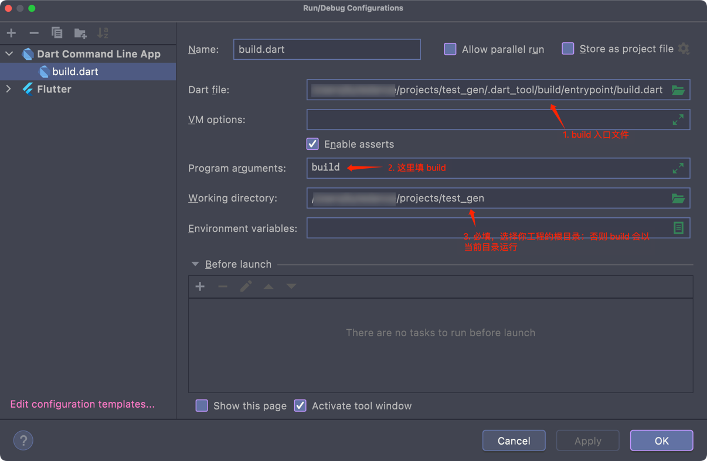

# Dart 代码生成

Dart 很奇怪，一个 dart 源文件就是一个 library。

## 调试


这里是 build 的入口文件，打开看下：

```dart
final _builders = <_i1.BuilderApplication>[
  _i1.apply(r'source_gen:combining_builder', [_i2.combiningBuilder],
      _i1.toNoneByDefault(),
      hideOutput: false, appliesBuilders: const [r'source_gen:part_cleanup']),
  _i1.apply(r'test_gen_generator:all_files_builder', [_i3.allFilesBuilder],
      _i1.toDependentsOf(r'test_gen_generator'),
      hideOutput: false),
  _i1.apply(r'test_gen_generator:test_builder', [_i4.testBuilder],
      _i1.toDependentsOf(r'test_gen_generator'),
      hideOutput: false),
  _i1.applyPostProcess(r'source_gen:part_cleanup', _i2.partCleanup)
];
void main(List<String> args, [_i5.SendPort? sendPort]) async {
  var result = await _i6.run(args, _builders);
  sendPort?.send(result);
  _i7.exitCode = result;
}
```

里边包含了我们刚写的 builders。

打开 `Edit Configurations`，配置 build：



正常调试就行了。
