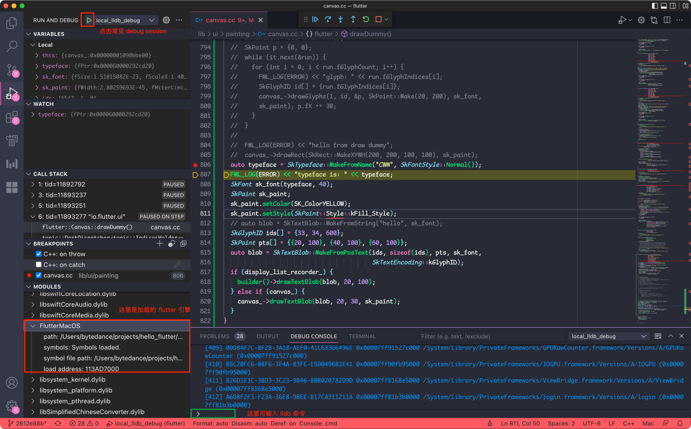
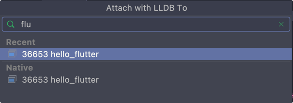
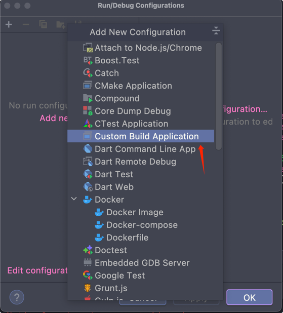
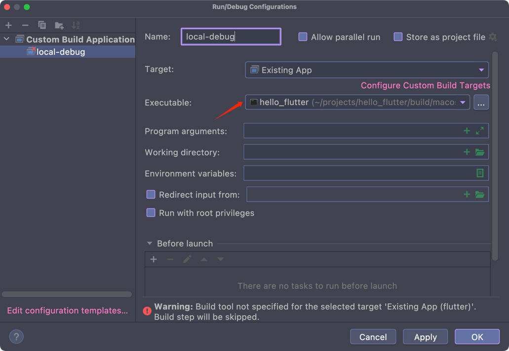
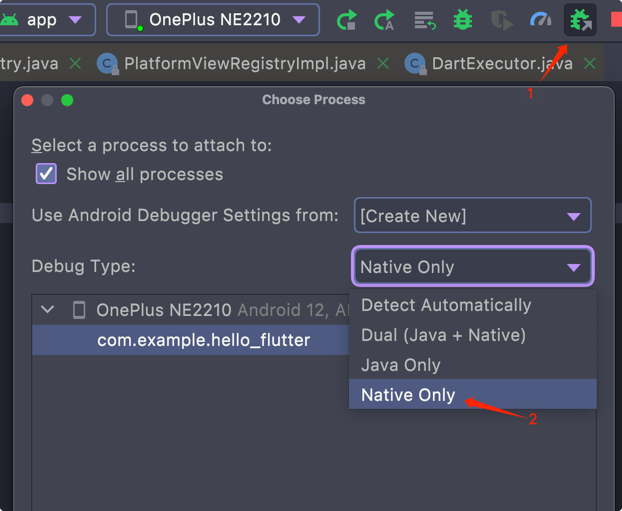
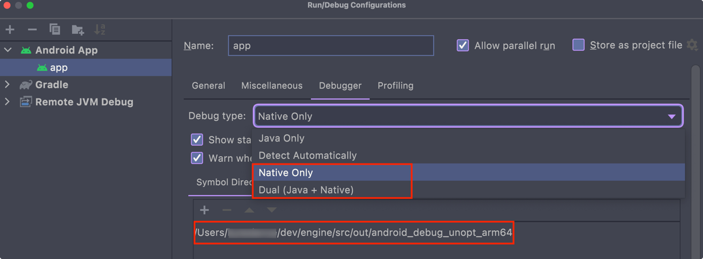
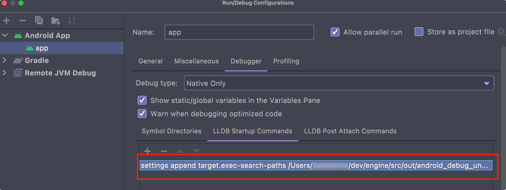
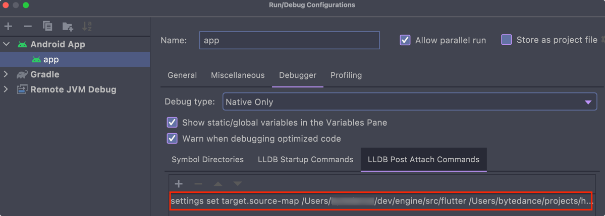
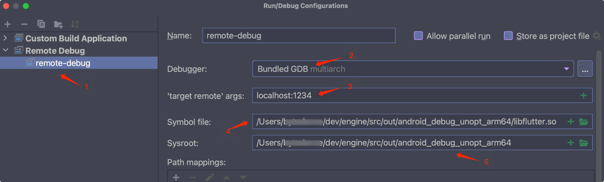
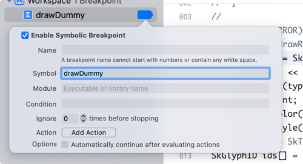

# 调试 Flutter 引擎

参考：

- [编译 flutter 引擎](compile-flutter-engine.md)
- [Flutter 引擎开发](flutter-engine-dev.md)

以下都以实验项目 `hello_flutter` 为例.

## 本机调试

在 macOS 下，测试项目的最终的打包产物位于 `<test-project>/build/macos/Build/Products/Debug/hello_flutter.app/Contents/MacOS/` 目录下，入口可执行文件为 `hello_flutter`。

Linux 下类似，但是有一点不一样，通过 `nm` 和 `dumpobj` 发现 Linux 下编译的 so 库没有符号表，Linux 下编译默认会 strip 掉 debug symbol，按以下步骤调试会导致找不到符号表而无法定位到源文件，因此用 `gn` 生成编译脚本时需要加上以下参数：

```shell
./flutter/tools/gn --unoptimized --unstripped
```

### 使用命令行

直接在终端使用 lldb 调试（命令行 lldb 是真的难用，又没有类似 cgdb 这样的替代品，建议使用 cgdb）：

```shell
lldb <test-project>/build/macos/Build/Products/Debug/hello_flutter.app/Contents/MacOS/hello_flutter
```

以下是一些常用命令：

| 命令 | 说明                                              |
| ---- |-------------------------------------------------|
| b | 设置断点，例：`b canvas.cc:120`，在 canvas.cc 文件的 120 行打断点 |
| r | 启动程序，run                                        |
| bt | 查看调用栈，backtrace                                 |
| c | 继续执行，continue                                   |
| n | 执行下一步，next                                      |
| s | 执行下一步，step                                      |

更多命令可参考 [lldb](https://lldb.llvm.org/)。

当然也可以进入到 GUI 模式（在 lldb session 中输入 `gui` 进入，就是个半成品，最近更新时间还是 18 年，而且没有文档），如果对 Vim 熟悉的话，建议安装 Vim lldb 插件，调试还是很好用的。也可以使用 [voltron](https://github.com/snare/voltron) 来查看内存、寄存器等调试信息。如何使用可参考[这个文档](https://lldb.llvm.org/use/map.html)。

### 配置 VSCode

VSCode 支持 [JSON Compilation Database Format Specification](https://clang.llvm.org/docs/JSONCompilationDatabase.html) 项目，打开 engine 所在的目录即将引擎的工程导入到 VSCode 的 workspace 中。

需要安装的插件：

- [C/C++ for Visual Studio Code](https://marketplace.visualstudio.com/items?itemName=ms-vscode.cpptools)
- [CodeLLDB](https://marketplace.visualstudio.com/items?itemName=vadimcn.vscode-lldb)

配置 `CodeLLDB` launch，在 `.vscode` 目录下新建 `launch.json` 文件，添加以下内容：

```json
{
  "version": "0.2.0",
  "configurations": [
    {
      "name": "local_lldb_debug",
      "type": "lldb",
      "request": "launch",
      "program": "<test-project>/build/macos/Build/Products/Debug/hello_flutter.app/Contents/MacOS/hello_flutter"
    }
  ]
}
```

参数解释：

- name: 启动配置的名称
- type: 启动类型，必须为 `lldb`
- request: 启动请求，这里为 `launch` 表示直接启动程序，关于远程调试在之后介绍。
- program: 程序路径

然后在需要调试的地方添加断点，启动调试即可。如图：



关于 `CodeLLDB` 更多使用方式，参考[文档](https://github.com/vadimcn/vscode-lldb/blob/v1.7.0/MANUAL.md)。

### 配置 CLion

对于喜欢使用 CLion 的开发者：

- Attach 到已运行项目，**Run > Attach to Process**，将 debugger attach 到指定进程，如图：



- 配置 Run configuration，打开 **Edit Configurations** 选择 **Custom Build Application**，如图：



选择编译好的实验项目，如图：



然后调试即可，非常简单方便。

## 远程调试 Android

需要使用 lldb 的 remote debug 功能。Android Studio 竟然支持 `Dual` 模式，可以同时调试 Java 代码和 native 代码。 （不幸的是，Android Studio 不支持同时调试 Dart 和 native）。

首先需要明确：

- lldb-server 在 Android 机器上启动一个 lldb（或 gdb 协议）的调试服务，通过指定 host 和端口连接到本机
- lldb（或 gdb）client 运行在本机，通过 IP 地址和端口连接到 Android 机器
- adb 可将 Android 端口映射到本机端口，因此本机 client 可直接连接到本机

首先，需要将 lldb-server push 到 Android 机器上：

- 打开 Flutter 项目中的 Android 项目，**没错，这一步是必须的**，如果是以 Flutter 模式打开，是没有 native 调试选项的
- 选择 **Attach Debugger to Android Process**
- 选择 native only，确定，这一步 Android Studio 将会把 lldb push 到 Android 机器上

如图：



有的手机可能不支持 `run-as`，这样的话就无法通过 lldb 调试（run-as 可以在非 root 的手机上查看应用的私有目录，如果设备不支持 run-as，那么就无法将 lldb push 到应用私有目录，如果手机已 root，那当我没说），可以通过以下命令确认：

```shell
adb shell
run-as your.package.name
```

如果该命令无错误输出，那就表明支持 run-as。

通过以上步骤，切换到 `com.example.hello_flutter` 目录中（我的测试项目叫这个名字）：

```shell
adb shell
OP516EL1:/ $ run-as com.example.hello_flutter
OP516EL1:/data/user/0/com.example.hello_flutter $ ls
app_flutter  cache  code_cache  files  lldb
OP516EL1:/data/user/0/com.example.hello_flutter $ ls lldb
bin  log  tmp
OP516EL1:/data/user/0/com.example.hello_flutter $ ls lldb/bin
lldb-server  start_lldb_server.sh
```

可以看到 `lldb/bin` 下有了 lldb-server。

参考 lldb [Remote Debugging](https://lldb.llvm.org/use/remote.html)，启动 lldb-server：

- 通过指定端口启动：

```shell
adb shell
$ run-as com.example.hello_flutter
$ ./lldb/bin/lldb-server platform --listen "*:1234" --server
```

通配符 `*` 表示任何设备都能连接到端口 `1234`。然后再开一个终端，连接到 lldb-server，设备是通过 USB 连接，这里不能通过 IP 连接，而是通过设备名称连接（通过 wifi 调试还没试过）：

```shell
adb devices
<your-device-name> device
# 开启一个 lldb session，连接到 lldb-server
lldb
(lldb) platform select remote-android
  Platform: remote-android
 Connected: no
(lldb) platform connect connect://<your-device-name>:1234
  Platform: remote-android
    Triple: aarch64-unknown-linux-android
OS Version: 31 (5.10.66-android12-9-gc634142fd3d8-ab8094802)
  Hostname: localhost
 Connected: yes
WorkingDir: /data/user/0/com.example.hello_flutter
    Kernel: #1 SMP PREEMPT Wed Jan 19 19:31:18 UTC 2022
(lldb) 
```

成功连接到 lldb-server。

当然也可以通过 adb 转发 tcp 连接，将 Android 机器上的 ip/port 转发到本机，这样就可以通过 localhost 连接了：

```shell
adb forward tcp:1234 tcp:1234
lldb
(lldb) platform select remote-android
(lldb) platform connect connect://localhost:1234
...
``` 

- 通过 unix-connect 启动：

```shell
adb shell
$ run-as com.example.hello_flutter
$ /lldb/bin/lldb-server platform\
  --listen "unix-abstract:///hello-flutter/debug.sock" --server 
```

另起一个终端，连接到 lldb-server：

```shell
(lldb) platform select remote-android
(lldb) platform connect unix-abstract-connect:///hello-flutter/debug.sock
...
```

连接到 lldb-server 后，可以直接使用 lldb 调试，首先需要启动应用，并获取其进程号，然后 attach debugger 到进程：

```shell
adb shell am start com.example.hello_flutter/.MainActivity
# 获取进程号   
adb shell pidof com.example.hello_flutter
# attach 到指定进程
(lldb) process attach -p 26896
```

这时还不能打断点，因为 lldb 没有读取符号表信息，无法定位到源文件，添加符号表到 lldb：

```shell
(lldb) add-dsym <ENGINE_ROOT>/src/out/android_debug_unopt_arm64/libflutter.so
```

然后设置断点调试即可。

经过这些步骤，可以直接在终端使用 lldb 调试，但是对于需要边调试边看源码就很费劲了，所以有必要配置一下 IDE。

参考：

- [lldb-server](https://lldb.llvm.org/man/lldb-server.html)

### 配置 Android Studio

#### 配置源码环境

首先尝试下直接调试（需要在 Android 工程模式下打开），点击 `Debug 'app'`，惊喜的发现报以下错：

```
Caused by: org.gradle.process.internal.ExecException: Process 'command '/Users/*/dev/flutter/bin/flutter'' finished with non-zero exit value 1
```

看下详细信息：

```shell
lib/dummy_widget.dart:22:17: Error: The method 'GlyphRun' isn't defined for the class 'RenderDummy'.
 - 'RenderDummy' is from 'package:hello_flutter/dummy_widget.dart' ('lib/dummy_widget.dart').
Try correcting the name to the name of an existing method, or defining a method named 'GlyphRun'.
...
```

想想也对，测试工程使用了本地 engine，而且修改了 engine 的代码，这里 flutter 编译肯定失败。看下 flutter 编译命令是怎么集成到 gradle 的，打开 `app/build.gradle`：

```groovy
// 从 local.properties 中读取配置
def localProperties = new Properties()
def localPropertiesFile = rootProject.file('local.properties')
if (localPropertiesFile.exists()) {
    localPropertiesFile.withReader('UTF-8') { reader ->
        localProperties.load(reader)
    }
}

// flutter sdk 路径
def flutterRoot = localProperties.getProperty('flutter.sdk')
if (flutterRoot == null) {
    throw new GradleException("Flutter SDK not found. Define location with flutter.sdk in the local.properties file.")
}
// ...
apply plugin: 'com.android.application'
apply plugin: 'kotlin-android'
apply from: "$flutterRoot/packages/flutter_tools/gradle/flutter.gradle"
```

可以看到首先读取 `local.properties` 文件，得到一系列配置，然后 apply `flutter.gradle`，找到这个文件看下：

```groovy
@override
void apply(Project project) {
  // ...
  if (useLocalEngine()) {
    // This is required to pass the local engine to flutter build aot.
    String engineOutPath = project.property('local-engine-out')
    File engineOut = project.file(engineOutPath)
    if (!engineOut.isDirectory()) {
      throw new GradleException('local-engine-out must point to a local engine build')
    }
    localEngine = engineOut.name
    localEngineSrcPath = engineOut.parentFile.parent
  }
  // ...
}
// ...
private Boolean useLocalEngine() {
  return project.hasProperty('local-engine-repo')
}
// ...
private Boolean supportsBuildMode(String flutterBuildMode) {
  if (!useLocalEngine()) {
    return true;
  }
  assert project.hasProperty('local-engine-build-mode')
  // Don't configure dependencies for a build mode that the local engine
  // doesn't support.
  return project.property('local-engine-build-mode') == flutterBuildMode
}
```

可以看到 local engine 的配置是从 `local-engine-out` 中读取的，而 `useLocalEngine` 则读取 `local-engine-repo` 配置，如果没有配置，则认为没有使用 local engine，并且在构建时会读取 local engine 的 build 模式，所以这几个配置都是必须的。但是 `local-engine-repo` 是个啥？看名字应该是一个 maven 仓库，这里先不管，先设置上编译的文件夹作为本地仓库（看了下，这个文件夹下是没有 maven 仓库的，所以编译肯定出错）。

配置一下 `gradle.properties` 设置上本地 engine：

```
# 这里会出错，但是不影响之后的步骤
local-engine-repo=<ENGINE_ROOT>/src/out/android_debug_unopt_arm64
local-engine-out=<ENGINE_ROOT>/src/out/android_debug_unopt_arm64
local-engine-build-mode=debug
```

运行！又报错：

```
Could not find any matches for io.flutter:armeabi_v7a_debug:+ as no versions of io.flutter:armeabi_v7a_debug are available.
```

问题很明确，我们确实没编译 arm v7a abi 的 engine，查看了下 `flutter.gradle` 源码：

```groovy
// ...
/** The platforms that can be passed to the `--Ptarget-platform` flag. */
private static final String PLATFORM_ARM32  = "android-arm";
private static final String PLATFORM_ARM64  = "android-arm64";
private static final String PLATFORM_X86    = "android-x86";
private static final String PLATFORM_X86_64 = "android-x64";
// ...
private List<String> getTargetPlatforms() {
    if (!project.hasProperty('target-platform')) {
        return DEFAULT_PLATFORMS
    }
    return project.property('target-platform').split(',').collect {
        if (!PLATFORM_ARCH_MAP[it]) {
            throw new GradleException("Invalid platform: $it.")
        }
        return it
    }
}
```

platforms 是通过 `target-platform` 指定的，加上这个配置：

```
target-platform=android-arm64
```

运行，毫无意外再次报错：

```
Could not find any matches for io.flutter:arm64_v8a_debug:+ as no versions of io.flutter:arm64_v8a_debug are available.
     Searched in the following locations:
       - https://dl.google.com/dl/android/maven2/io/flutter/arm64_v8a_debug/maven-metadata.xml
       - https://repo.maven.apache.org/maven2/io/flutter/arm64_v8a_debug/maven-metadata.xml
       - file:<ENGINE_ROOT>/src/out/android_debug_unopt_arm64/io/flutter/arm64_v8a_debug
```

问题很明确，在仓库里找不到需要的库。但是为啥在 flutter 模式下运行良好呢？以 verbose 模式运行，可以看到编译的日志：

```
executing: [/Users/*/projects/hello_flutter/android/]\
 /Users/*/projects/hello_flutter/android/gradlew --full-stacktrace --info -Pverbose=true\
  -Plocal-engine-repo=/var/folders/30/cmv9c_5j3mq_kthx63sb1t5c0000gn/T/flutter_tools.hvk5yq/flutter_tool_local_engine_repo.FWvTc2\
  -Plocal-engine-build-mode=debug\
  # ...
```

可以看到 `-Plocal-engine-repo` 后跟的应该是一个生成的文件夹，tree 看一下：

```
└── io
    └── flutter
        ├── arm64_v8a_debug
        │   ├── 1.0.0-4849393923f6eba9d2186d88c6ae912a5b719437
        │   │   ├── arm64_v8a_debug-1.0.0-4849393923f6eba9d2186d88c6ae912a5b719437.jar -> /Users/*/dev/engine/src/out/android_debug_unopt_arm64/arm64_v8a_debug.jar
        │   │   └── arm64_v8a_debug-1.0.0-4849393923f6eba9d2186d88c6ae912a5b719437.pom -> /Users/*/dev/engine/src/out/android_debug_unopt_arm64/arm64_v8a_debug.pom
        │   └── maven-metadata.xml -> /Users/*/dev/engine/src/out/android_debug_unopt_arm64/arm64_v8a_debug.maven-metadata.xml
        └── flutter_embedding_debug
            ├── 1.0.0-4849393923f6eba9d2186d88c6ae912a5b719437
            │   ├── flutter_embedding_debug-1.0.0-4849393923f6eba9d2186d88c6ae912a5b719437.jar -> /Users/*/dev/engine/src/out/android_debug_unopt_arm64/flutter_embedding_debug.jar
            │   └── flutter_embedding_debug-1.0.0-4849393923f6eba9d2186d88c6ae912a5b719437.pom -> /Users/*/dev/engine/src/out/android_debug_unopt_arm64/flutter_embedding_debug.pom
            └── maven-metadata.xml -> /Users/*/dev/engine/src/out/android_debug_unopt_arm64/flutter_embedding_debug.maven-metadata.xml
```

可以看到确实是一个 maven 仓库，其中文件都是软链接到自己编译的引擎。如何生成这个仓库？最简单的方式是直接在 `gradle.properties` 中使用这个生成的仓库。或者自己按照这个文件结构拷贝一份。还有一种方式是通过 `flutter build aar` 来生成，这里不详细介绍，可以参考 [flutter build aar](https://docs.flutter.dev/development/add-to-app/android/project-setup)，以及这个 [PR](https://github.com/flutter/flutter/pull/49276)。

这里直接使用生成的仓库，可以成功编译运行。

参考：

- [Debug gradle](https://stackoverflow.com/questions/58408741/debugging-gradle-files-in-android-studio)

#### 配置调试环境

Android Studio 调试 native 代码必须要源码在工程中，否则无法打断点，所以需要首先将源码链接到工程：

```shell
cd <your-test-project>/android
ln -s <ENGINE_ROOT>/src/flutter ./engine
```

##### 配置 LLDB

配置 debug configuration，配置符号表搜索路径，AS 在启动调试前会执行 LLDB Startup Commands，在 attach 到进程之后会执行 LLDB Post Attach Commands，分别配置：

- LLDB Startup Commands

```shell
settings append target.exec-search-paths <ENGINE_ROOT>/src/out/android_debug_unopt_arm64
```

这个命令将符号表搜索路径配置到 LLDB 中，这样 LLDB 就可以搜索到 debug symbol 了。

**注意：因为我们将引擎代码链接到了 `<your-test-project>/android` 这个目录下了，而 LLDB 在解析 debug symbol 时得到的源码是在 `<ENGINE_ROOT>/src/flutter` 这个目录，因此我们需要将源码目录映射回引擎的目录。**

- LLDB Post Attach Commands

```shell
settings set target.source-map <ENGINE_ROOT>/src/flutter <your-test-project>/android/engine
```

LLDB 的文档比较乱，我更多的文档都是参考 gdb 的，然后搜 lldb 对应的命令，一般 gdb 中的命令都在 lldb 中有定义，参考 [GDB to LLDB command map](https://lldb.llvm.org/use/map.html)。

设置符号表搜索目录：



设置 commands:





打断点调试即可。

AS 对 C++ 支持不好，也不支持 [JSON Compilation Database Format Specification](https://clang.llvm.org/docs/JSONCompilationDatabase.html)，所以代码编写和跳转就很费劲。 

参考：

- [LLDB Remote Debugging](https://lldb.llvm.org/use/remote.html)
- [Android Debug](https://developer.android.com/studio/debug)

### 配置 CLion

**很遗憾，CLion 的 Remote debug 基本上属于不可用状态，不管是用 lldb 还是 gdb 都有各种各样的问题，先把配置方式放在这，有空再研究。**

Android 机器上：

```shell
adb shell
run-as com.example.hello_flutter
./lldb/bin/lldb-server g :1234 --attach <pid>
```
`g` 表示以 gdb protocal 协议运行，`:1234` 表示监听在 1234 端口，`--attach <pid>` 表示 attach 到进程 <pid>。

CLion run configuration:



1. 添加 Remote Debug 运行配置
2. 设置为 Bundled GDB，lldb 也可以，但是 lldb 连接不上
3. 要连接到的目标
4. 符号表路径，直接用编译好的 so 即可
5. 设置到哪找文件

参考：

- [Debugging with GDB](https://wladimir-tm4pda.github.io/porting/debugging_gdb.html)
- [CLion Remote Debug](https://www.jetbrains.com/help/clion/remote-debug.html)

### 配置 VSCode

既然 CLion 不可用，幸好 VSCode 也支持 [JSON Compilation Database Format Specification](https://clang.llvm.org/docs/JSONCompilationDatabase.html) 项目，虽然写代码体验不如 CLion，但是还是可以用。

同调试本地应用一样，需要配置 CodeLLDB，在 `lauch.json` 文件的 `configurations` 中添加以下配置：

```shell
{
  "type": "lldb",
  "request": "attach",
  "name": "lldb_android_debug",
  "pid": "22572",
  "initCommands": [
    "platform select remote-android",
    "platform connect connect://localhost:1234"
  ],
  "postRunCommands": [
    "add-dsym <ENGINE_ROOT>/src/out/android_debug_unopt_arm64/libflutter.so"
  ],
}
```

另启终端，在 Android 上启动 lldb-server，并打开要调试的应用，获取其 pid，然后在 `lauch.json` 中替换 pid。

```shell
adb shell
run-as com.example.hello_flutter
./lldb/bin/lldb-server p --listen "*:1234" --server
# 打开应用并获取 pid
adb shell am start com.example.hello_flutter/.MainActivity
adb shell pidof com.example.hello_flutter
```

在 **Run > lldb_android_debug** 启动 debug session，打上断点即可调试。

## 调试 iOS

首选 xcode，配置非常简单，打开实验项目 `ios/Runner.xcworkspace`，保证 build configuration 为 debug，然后通过 **Debug > Breakpoints > Create Symbolic Breakpoint** 添加断点，如图：



编译运行即可。
