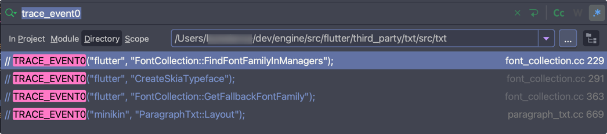
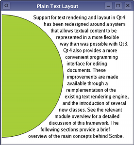

# 文本布局引擎性能对比

在 Android 平台上简单对比了下 text layout 性能。Flutter 3.0 上默认使用 skia paragraph 布局，因此也对 skia paragraph 跑了下测试。

ref:
- [Text shaping backend switch: SkShaper and SkParagraph](https://github.com/flutter/flutter/issues/39420)
- [SkParagraph bug tracks](https://bugs.chromium.org/p/skia/issues/list?q=Area=%22TextLayout%22)

测试机型：

OnePlus 10 Pro，Android 12，机型很新，性能较好

OnePlus 6，Android 8，为 2016 年机型，性能很差

Flutter 测试代码：

```dart
class TestWidget extends StatelessWidget {
  @override
  Widget build(BuildContext context) {
    return _testLayout(loadText());
  }

  Widget _testLayout(Future<String> load, [int times = 1000]) {
    return FutureBuilder(
      future: Future.delayed(const Duration(seconds: 2)).then((_) => load),
      builder: (context, AsyncSnapshot<String> snapshot) {
        if (snapshot.hasData) {
          return _loopLayoutText(snapshot.data!, times);
        }
        return const CircularProgressIndicator();
      },
    );
  }

  Widget _loopLayoutText(String lines, int times) {
    final watch = Stopwatch()..start();
    for (int i = 0; i < times; i++) {
      final painter = TextPainter(
        // 添加 $i 前缀避免缓存影响
        text: TextSpan(text: "$i $lines"),
      );
      painter.layout(maxWidth: 800);
    }
    print("$times times layout: ${watch.elapsedMilliseconds}'ms");
    return Container();
  }

  Future<String> _randomUnicodes(int start, int total, int count, 
      [void Function(StringBuffer sb, Random random)? onAddCodepoint]) {
      return compute((message) {
        final r = Random();
        final sb = StringBuffer();
        for (int i = 0; i <= count; i++) {
          sb.writeCharCode(r.nextInt(total) + start);
          onAddCodepoint?.call(sb, r);
        }
        return sb.toString();
      }, "");
  }
}
```

Android 测试代码：

```kotlin
fun testLayout(times: Int = 1000, loadTxt: () -> String) {
  scope.launch {
    delay(2000)
    val paint = TextPaint().apply {
      textSize = 14f
      color = Color.BLACK
    }
    val str = loadTxt()
    loopLayoutText(str, times, paint)
  }
}

fun loopLayoutText(txt: String, times: Int, paint: TextPaint) {
  measureTimeMillis {
    repeat(times) {
      // 添加 $it 前缀避免缓存影响
      val str = "$it $txt"
      val layout = StaticLayout.Builder.obtain(
        str, 0, str.length, paint, 800
      ).build()
    }
  }.also { Log.e("abc", "$times times layout: $it'ms") }
}

fun randomUnicodes(
  start: Int, total: Int, count: Int,
  onAddCodepoint: (StringBuilder, Random) -> Unit = { _, _ -> }
): String {
  val r = Random(System.currentTimeMillis())
  return StringBuilder().apply {
    repeat(count) {
      appendCodePoint(r.nextInt(total) + start)
      onAddCodepoint(this, r)
    }
  }.toString()
}
```

注意：tracing 对性能的影响巨大，从而影响对比，所以在跑测试时需要将 tracing 先去掉。



以下测试都以 profile 模式运行多次，取平均值，单位毫秒。

## 多语言文字混合

测试文本：lines.txt，共 5487 个字符，包含中文、英文、emoji，跑 1000 次：

| | Flutter minikin | skia parag | Android minikin |
|-|-----------------|------------|-----------------|
| Android 12 | 1,719 | 3,776 | 1,048 |
| Android 8  | 6,559 | 11,842 | 2,938 |

以 Android minikin 为 baseline，各引擎对比：

| | Flutter minikin | skia parag |
|-|-----------------|------------|
| Android 12 | 1.7 | 3.6 |
| Android 8 | 2.2 | 4 |

Android 12 和 Android 8 交叉对比：

| 8 / 12 | Flutter minikin | skia parag | Android minikin|
|--------|-----------------|------------|----------------|
| Flutter minikin | 3.8 | 1.7 | 6.3 |
| skia parag | 6.8 | 3.1 | 11.3 |
| Android minikin | 1.7 | 0.8 | 2.8|

## 仅中文

从 CJK Unified Ideograph 中随机生成字符（0x4E00 ~ 0x9FFF，共 20292 个字符，不包含 CJK extensions），共 5487 个字符，跑 1000 次：

```kotlin
fun loadCJK() = randomUnicodes(0x4e00, 20292, 5487)

```dart
_loadCJK() => _randomUnicodes(0x4e00, 20292, 5487);
```

| | Flutter minikin | skia parag | Android minikin |
|-|--|--|--|
| Android 12 | 3,829 | 10,784 | 2,107 |
| Android 8 | 15,818 | 29,502 | 6,444 |

以 Android minikin 为 baseline，各引擎对比：

| | Flutter minikin | skia parag |
|-|--|--|
| Android 12 | 1.8 | 5.1 |
| Android 8 | 2.5 | 4.6 |

Android 12 和 Android 8 交叉对比：

| 8 / 12 | Flutter minikin | skia parag | Android minikin | 
|--|--|--|--|
| Flutter minikin | 4.1 | 1.5 | 7.5 |
| skia parag | 7.7 | 2.7 |14
| Android minikin | 1.7 | 0.6 | 3.1 |

## 仅基础 Emoji

从 Emoticons (Unicode block) 中随机生成字符（0x1F600 ~ 0x1F64f，基础 Unicode 表情，共 80 个字符，不包含 variation selector，Emoji modifier，以及 zero width joiner），共 5487 个字符，跑 1000 次：

```kotlin
fun loadEmoji() = randomUnicodes(0x1f600, 80, 5487)
```

```dart
_loadEmoji() => _randomUnicodes(0x1f600, 80, 5487);
```

| | Flutter minikin |skia parag | Android minikin|
|-|-|-|-|
|Android 12|7,888|6,077|22,464|
|Android 8|20,378|18,122|2,996|

以 Android minikin 为 baseline，各引擎对比：

| |Flutter minikin|skia parag|
|-|-|-|
|Android 12|0.4|0.3
|Android 8|6.8|6|

Android 12 和 Android 8 交叉对比：

|8 / 12|Flutter minikin|skia parag|Android minikin|
|-|-|-|-|
|Flutter minikin|2.6|3.4|0.9|
|skia parag|2.3|3|0.8|
|Android minikin|0.4|0.5|0.1|

Android 12 上 Android minikin 比起 Flutter minikin 性能更低；skia 的性能表现反而更好。

## variation selector, modifier, zero width joiner

从 Emoticons (Unicode block) 中随机生成字符（0x1F600 ~ 0x1F64f，基础 Unicode 表情，共 80 个字符，包含 variation selector，Emoji modifier，以及 zero width joiner），共 5487 个字符，跑 1000 次：

```kotlin
fun loadEmojiVMZ() = randomUnicodes(0x1f600, 80, 5487) { sb, r ->
  // add variation selector
  when (r.nextInt(7)) {
    1 -> sb.appendCodePoint(0xfe0f)
    2 -> sb.appendCodePoint(0xfe0e)
  }
  // add modifier, from 0x1f3fb to 0x1f3ff
  val m = r.nextInt(10)
  if (m < 5) sb.appendCodePoint(0x1f3fb + m)
  // add ZWJ
  if (r.nextInt(7) == 0) sb.appendCodePoint(0x200d)
}
```

```dart
_loadEmojiVMZ([int count = 5487]) => _randomUnicodes(0x1f600, 80, count, (sb, random) {
      // add variation selector
      final v = random.nextInt(7);
      switch (v) {
        case 1:
          sb.writeCharCode(0xfe0f);
          break;
        case 2:
          sb.writeCharCode(0xfe0e);
          break;
      }
      // add modifier, from 0x1f3fb to 0x1f3ff
      final m = random.nextInt(10);
      if (m < 5) sb.writeCharCode(0x1f3fb + m);
      // add ZWJ
      final z = random.nextInt(7);
      if (z == 0) sb.writeCharCode(0x200d);
    });
```

| |Flutter minikin|skia parag|Android minikin|
|-|-|-|-|
|Android 12|17,763|12,047|251,594|
|Android 8|42,740|34,387|4,604|

以 Android minikin 为 baseline，各引擎对比：

| |Flutter minikin|skia parag|
|Android 12|0.07|0.05|
|Android 8|9.3|7.5|

Android 12 和 Android 8 交叉对比：

|8 / 12|Flutter minikin|skia parag|Android minikin|
|-|-|-|-|
|Flutter minikin|4.1|1.5|7.5|
|skia parag|7.7|2.7|14|
|Android minikin|1.7|0.6|3.1|

同 emoji 一样，Android minikin 比起 Flutter minikin 性能更低；skia 的性能表现反而更好。

ref:
- [variation selector](https://nanomichael.github.io/MicroTeX/?tex=%5Ctext%7B%5Cchar%222603%5Cchar%22fe0f%5Cchar%222603%5Cchar%22fe0e%7D)
- [emoji modifier](https://nanomichael.github.io/MicroTeX/?tex=%5Ctext%7B%5Cchar%221f474%5Cchar%221f3fb%5Cchar%221f474%5Cchar%221f3fc%5Cchar%221f474%5Cchar%221f3fd%5Cchar%221f474%5Cchar%221f3fd%7D)
- [zero width joiner](https://nanomichael.github.io/MicroTeX/?tex=%5Ctext%7B%5Cchar%221f468%5Cchar%22200d%5Cchar%221f469%5Cchar%22200d%5Cchar%221f467%20%5Cchar%221f468%5Cchar%22200d%5Cchar%221f466%7D)

## bidi

从 a ~ z 随机生成文本，并随机加入 U+202E（强制从右往左布局）和 U+202C（取消 bidi format），跑 1000 次：

```kotlin
fun loadBidi() = randomUnicodes('a'.code, 26, 5487) { sb, r ->
  val v = r.nextInt(10)
  if (v == 0) {
    sb.appendCodePoint(32)
    sb.appendCodePoint(0x202E)
  } else if (v == 1) {
    sb.appendCodePoint(32)
    sb.appendCodePoint(0x202C)
  }
}
```

```dart
_loadBidi([int count = 5487]) => _randomUnicodes('a'.codeUnitAt(0), 26, count, (sb, random) {
      final v = random.nextInt(10);
      if (v == 0) {
        sb.writeCharCode(32);
        sb.writeCharCode(0x202E);
      } else if (v == 1) {
        sb.writeCharCode(32);
        sb.writeCharCode(0x202C);
      }
    });
```

||Flutter minikin|skia parag|Android minikin|
|-|-|-|-|
|Android 12|7,200|18,109|2,082|
|Android 8|30,375|65,457|4,904|

以 Android minikin 为 baseline，各引擎对比：

||Flutter minikin|skia parag|
|-|-|-|
|Android 12|3.5|8.7|
|Android 8|6.2|13.3|

Android 12 和 Android 8 交叉对比：

|8 / 12|Flutter minikin|skia parag|Android minikin|
|-|-|-|-|
|Flutter minikin|4.2|1.7|14.6|
|skia parag|9.1|3.6|31|
|Android minikin|0.7|0.3|2.4|

Android minikin 表现强劲

ref:
- [bidirectional text](https://en.wikipedia.org/wiki/Bidirectional_text)

## 初步结论

Flutter minikin 的优化空间还很大。简单对比了 Flutter minikin 的代码和 Android minikin 的代码，它俩并不一致，Flutter minikin 从 Android 8.0 上移植而来，（更新时间为 2017 年，后续并未从 Android 更新）；经对比 Android 12 与 Android 8 minikin，发现在 Android 12 上还有些负优化，尤其是在 emoji 排版上；skparagraph 的性能堪忧，和 minikin 差距太大（但在 emoji 的处理上更好，可以参考），从 skia 官方文档来看，并未提供具体的测试样例，且只介绍了在 web 平台（通过 canvaskit）上的使用，没有 minikin 成熟（毕竟 minikin 在 Android 平台上这么多年运行良好，且经过各语言地区大量的验证，skia paragraph 的使用并不如 minikin 这么广泛）。

## Qt 文本布局

另外测试了下 Qt 的文本布局，其 API 设计非常优雅，底层允许用户以行级别进行布局，从而实现各种奇怪的文本布局，举个🌰：

```c++
QTextLayout textLayout(text, font);
qreal margin = 10;
qreal radius = qMin(width()/2.0, height()/2.0) - margin;
QFontMetrics fm(font);

qreal lineHeight = fm.height();
qreal y = 0;

textLayout.beginLayout();

while (1) {
    // create a new line
    QTextLine line = textLayout.createLine();
    if (!line.isValid())
        break;

    qreal x1 = qMax(0.0, pow(pow(radius,2)-pow(radius-y,2), 0.5));
    qreal x2 = qMax(0.0, pow(pow(radius,2)-pow(radius-(y+lineHeight),2), 0.5));
    qreal x = qMax(x1, x2) + margin;
    qreal lineWidth = (width() - margin) - x;

    line.setLineWidth(lineWidth);
    line.setPosition(QPointF(x, margin+y));
    y += line.height();
}

textLayout.endLayout();

QPainter painter;
painter.begin(this);
painter.setRenderHint(QPainter::Antialiasing);
painter.fillRect(rect(), Qt::white);
painter.setBrush(QBrush(Qt::black));
painter.setPen(QPen(Qt::black));
textLayout.draw(&painter, QPoint(0,0));

painter.setBrush(QBrush(QColor("#a6ce39")));
painter.setPen(QPen(Qt::black));
painter.drawEllipse(QRectF(-radius, margin, 2*radius, 2*radius));
painter.end();
```

以上代码进行了一个「圆形」布局，如图：



以上代码来自：[Qt document layouts](https://doc.qt.io/qt-6/richtext-layouts.html)
